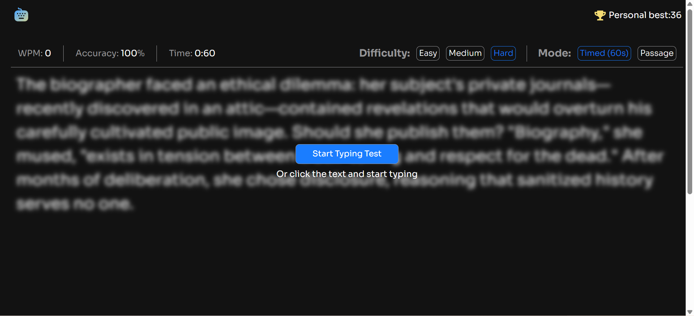

# Frontend Mentor - Typing Speed Test solution

This is a solution to the [Typing Speed Test challenge on Frontend Mentor](https://www.frontendmentor.io/challenges/typing-speed-test). Frontend Mentor challenges help you improve your coding skills by building realistic projects. 

## Table of contents

- [Overview](#overview)
  - [The challenge](#the-challenge)
  - [Screenshot](#screenshot)
  - [Links](#links)
- [My process](#my-process)
  - [Built with](#built-with)
  - [What I learned](#what-i-learned)
  - [Continued development](#continued-development)
  - [Useful resources](#useful-resources)
  - [AI Collaboration](#ai-collaboration)
- [Author](#author)
- [Acknowledgments](#acknowledgments)

**Note: Delete this note and update the table of contents based on what sections you keep.**

## Overview

### The challenge

Users should be able to:

- View the optimal layout for the interface depending on their device's screen size
- See hover and focus states for all interactive elements on the page

### Screenshot




### Links

- Solution URL: [solution URL here](https://github.com/abenezer-lab-code/interactive-rating-component.git)
- Live Site URL: [live site URL here](https://abenezer-lab-code.github.io/typing-speed-test/)


### Built with

- Semantic HTML5 markup
- CSS custom properties
- Flexbox
- CSS Grid
- Mobile-first workflow
- vanilla javascript

### What I learned

 - In this project, I learned a lot about how to manipulate the DOM more clearly and how to break problems into smaller parts. I also learned that using functions helps organize this process by breaking complex problems into reusable, manageable pieces

```html

 <button class="modebtn btn" aria-controls="mobile-mode-form" aria-expanded="false">Timed(60s) </button>
        <form class="mobile-mode-control" id="mode-control-form">
<fieldset>
  <div class="form-line">
   <input type="radio" name="mode" value="timed" id="timed">
  <label for="timed">Timed(60s)</label>
 </div>
 <div class="form-line">
   <input type="radio" name="mode" value="passage" id="passage">
  <label for="passage">Passage</label>
</div>
</fieldset>
        </form>  
```
```css
.btn:focus::before{
  content: "";
  width: 100%;
  height: 100%;
  position: absolute;
  top: -2px;
  left: -2px;
  padding: 2px;
  outline: 2px solid var(--blue-600);
  border-radius: 7px;
  z-index: -1;
  background-color: var(--neutral-900);
}
```
```js
const isCorrect = (paragraph,usertext)=>{
    
const currentCharacterIndex = usertext.length-1;

const lastCharacter = usertext[lastCharacterIndex];

if(paragraph[currentCharacterIndex] === lastCharacter) return true
return false


}

```


### Continued development
- I am still not very comfortable with CSS animations, so I plan to focus more on them in the future to make my pages more interactive and engaging
### Useful resources

- [Example resource ](https://www.freeCodeCamp.com) - This helped me on accessibility


### AI Collaboration

i use Ai to expalin me how to calculat word per minute and accuracy.


## Author

- Frontend Mentor - [@yourusername](https://www.frontendmentor.io/profile/yourusername)


